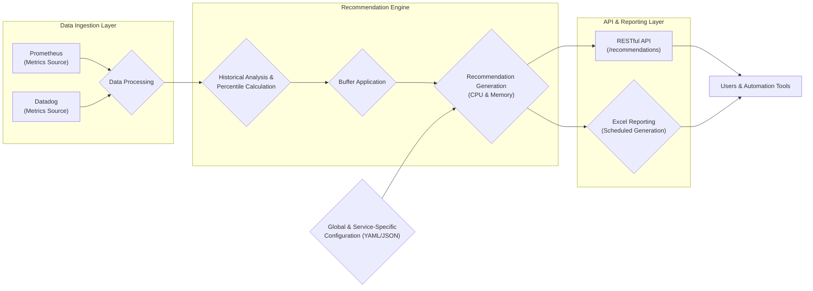

## Project Vyom: Resource Recommender System for Kubernetes

### 1. Introduction

**Project Vyom** is designed to optimize resource utilization in Kubernetes environments. By intelligently recommending CPU and Memory allocations for deployments, it aims to prevent resource waste and ensure smooth application performance. This document serves as a guide for developers, managers, and executives to understand, configure, and leverage Vyom's capabilities.

### 2. Business Problem & Solution

**Challenge:** Kubernetes deployments often suffer from inefficient resource allocation. Over-provisioning leads to wasted resources and increased costs, while under-provisioning can cause performance bottlenecks and application instability. Manually determining optimal resource requests and limits is time-consuming, error-prone, and difficult to maintain as application behavior evolves.

**Vyom's Solution:** By analyzing historical resource usage data, Vyom provides data-driven recommendations for CPU and Memory allocation, tailored to each deployment's needs. This eliminates guesswork, minimizes manual intervention, and helps achieve cost efficiency and performance stability.

### 3. Functional Requirements

* **Historical Analysis:** Analyze CPU and Memory usage patterns over a configurable **lookback period** (default: 14 days) to provide informed recommendations.
* **Buffer for Spikes:** Add a configurable **buffer** (default: 30%) to recommended values, accommodating temporary workload spikes and preventing resource contention.
* **Flexible Recommendation Types:** Choose from four percentile-based recommendation types:
* **Max:** Utilizes the maximum observed usage within the lookback period. Useful for extremely volatile workloads.
* **p99:** Employs the 99th percentile usage for a balance between resource efficiency and performance assurance.
* **p95:** Leverages the 95th percentile usage, suitable for moderately fluctuating workloads.
* **p90:** Based on the 90th percentile usage, ideal for stable workloads with predictable resource requirements.
* **Deployment Exclusion:** Provide the flexibility to exclude specific deployments from the recommendation analysis if needed.
* **Dynamic Adjustments:** Automatically trigger a new analysis period and generate updated recommendations whenever resource modifications are made to a deployment.
* **Blue-Green Deployment Awareness:** Ensure consistent recommendations across blue-green deployments for seamless updates without performance degradation.
* **Centralized Configuration:** Manage all parameters globally at a service level, allowing for fine-tuning and customized resource management strategies.
* **Actionable Reporting:** Generate comprehensive reports in Excel format, providing insights into historical usage, recommendations, and configuration parameters for easy analysis, sharing, and decision-making.
* **Grafana Dashboard:** Create a comprehensive dashboard for visualizing the metrics after the recommendation calculations.

### 4. System Architecture

Vyom's architecture consists of three core components:

1. **Data Collection Layer:**
    * **Integration with Monitoring Systems:** Leverages robust monitoring solutions like Prometheus or Datadog to gather raw CPU and Memory usage metrics at various granularities: Deployment, Pod, and Container levels.
    * **Flexible Data Ingestion:** Adapts to different monitoring setups, enabling seamless integration with existing observability tools.

2. **Recommendation Engine:**
    * **Data Processing & Analysis:** Processes the collected data, filters it based on configured parameters (lookback period, excluded deployments), and calculates relevant percentile values (p90, p95, p99, Max).
    * **Recommendation Logic:** Applies the selected recommendation type and adds the configured buffer to determine the final recommended resource allocation for CPU and Memory.
    * **Handling Dynamic Changes:** Incorporates logic to manage excluded deployments, account for resource modification events, and ensure consistency across blue-green deployments.

3. **API & Reporting Layer:**
    *  **RESTful API:** Exposes a user-friendly API for retrieving real-time recommendations for specific services, allowing easy integration with other tools and automation workflows.
    *  **Excel Reporting Engine:** Generates comprehensive reports containing detailed information: service name, current resource allocation, recommended allocation (CPU & Memory), recommendation type used, lookback period, buffer percentage, etc., for informed decision-making.



### 5. Implementation Details

**5.1. Data Collection**

* **Prometheus Configuration:**
    * **Recording Rules:** Define custom rules to calculate and store aggregated metrics (e.g., average CPU usage, maximum memory consumption) over the desired time window.
    * **Example:**
    ```yaml
    - record: deployment:cpu_usage:rate5m
    expr: sum(rate(container_cpu_usage_seconds_total{namespace="default", deployment="my-app"}[5m])) by (deployment)

    - record: deployment:memory_usage:mean5m
    expr: avg(container_memory_usage_bytes{namespace="default", deployment="my-app"}) by (deployment)
    ```
* **Datadog Configuration:**
    * **Metrics Queries:** Utilize Datadog's query language to define and retrieve the required CPU and Memory metrics with appropriate aggregation functions (e.g., `avg`, `max`) and time windows.
    * **Monitors:** Create dedicated monitors to track resource usage trends, set up alerts for potential bottlenecks, and visualize historical data.

**5.2. Recommendation Engine**

* **Data Retrieval:** The engine queries Prometheus/Datadog to fetch the historical usage data for the specified lookback period, filtering by deployment and metric type.
* **Percentile Calculation:** Using statistical functions, the engine determines the desired percentile value based on the chosen recommendation type (e.g., p95, Max).
* **Buffer Application:** The configured buffer percentage is added to the calculated percentile value, providing a safety net for unexpected workload fluctuations.
* **Recommendation Generation:** The final recommended values for CPU requests/limits and Memory requests/limits are generated for the target deployment.

**5.3. API & Reporting**

* **API Endpoints:**
    * `/api/v1/recommendations/{service}`: Retrieves recommendations for the specified service.
    * `/api/v1/recommendations`: Gets recommendations for all services.
* **Excel Reports:**
    * **Scheduled Generation:** Configure the system to automatically generate reports at regular intervals (e.g., daily, weekly).
    * **Data Visualization:** Include charts and graphs in the reports to visualize historical usage patterns and make the data more insightful.

### 6. Configuration and Deployment

**6.1. Global Configuration**

Create a configuration file (YAML or JSON) to define global parameters:

```yaml
    global:
    lookback_period: 14d # Default lookback period (14 days)
    buffer_percentage: 30 # Default buffer (30%)
    excluded_deployments: # List of deployments to exclude
    - kube-system
    - monitoring

    recommendations: # Service-specific recommendation types
    my-app: p99
    backend-service: p95
```

**6.2. Service-Specific Overrides**

Override global settings at the service level within the configuration file if needed:

```yaml
    recommendations:
    my-app:
    lookback_period: 7d # Override lookback period for 'my-app' to 7 days
    buffer_percentage: 20 # Override buffer for 'my-app' to 20%
```

**6.3. Deployment Steps**

1. **Deploy Vyom:** Deploy the Vyom application within your Kubernetes cluster using Helm charts or YAML manifests.
2. **Configure Monitoring Integration:** Set up the necessary connections and credentials for Vyom to access your Prometheus/Datadog instance.
3. **Apply Global Configuration:** Apply the global configuration file to Vyom to define default parameters and service-specific settings.

### 7. Usage and Benefits

1. **Retrieve Recommendations:** Use the Vyom API or access generated reports to obtain tailored resource recommendations for your deployments.
2. **Apply Recommendations:** Adjust your deployment YAML files with the recommended CPU and Memory requests and limits.
3. **Monitor and Fine-tune:** Continuously monitor application performance and resource utilization. Make further adjustments to the configuration as needed to optimize for your specific workloads and requirements.

**Benefits:**

* **Reduced Resource Costs:** Prevent over-provisioning and ensure that resources are allocated efficiently.
* **Improved Application Performance:** Minimize the risk of resource contention and performance degradation.
* **Automated Resource Management:** Reduce manual effort and human error in setting resource limits.
* **Data-Driven Decision Making:** Base resource allocation decisions on real usage patterns.
* **Increased Operational Efficiency:** Simplify resource management and free up valuable engineering time.

### 8. Conclusion

Project Vyom empowers you to take a data-driven approach to Kubernetes resource management, driving cost savings, performance optimization, and operational efficiency. By integrating Vyom into your workflow, you can establish a more robust and resilient Kubernetes environment.

